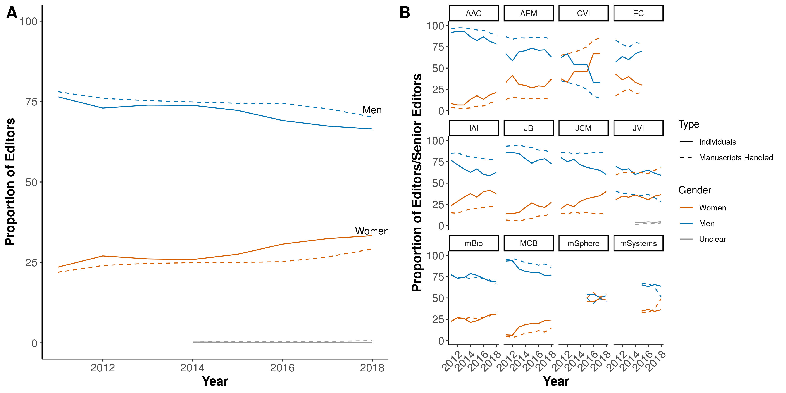
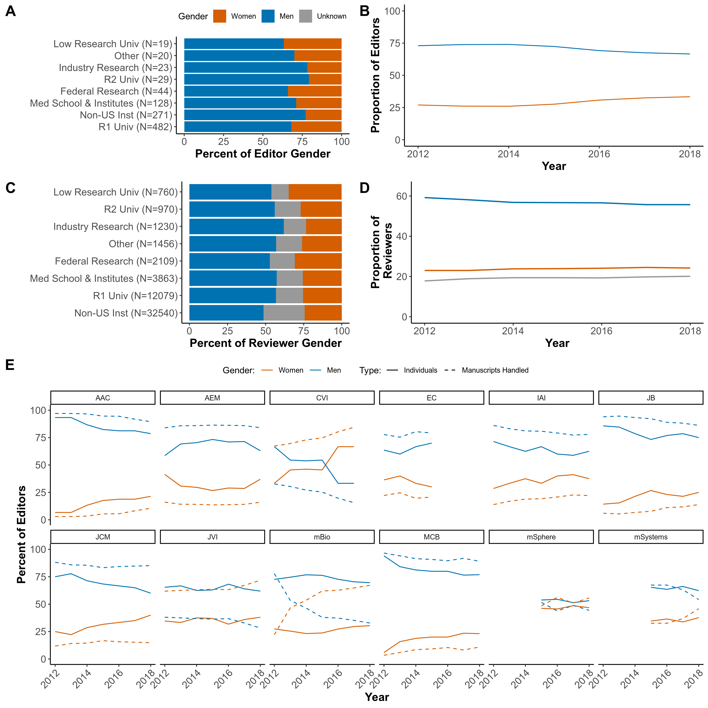
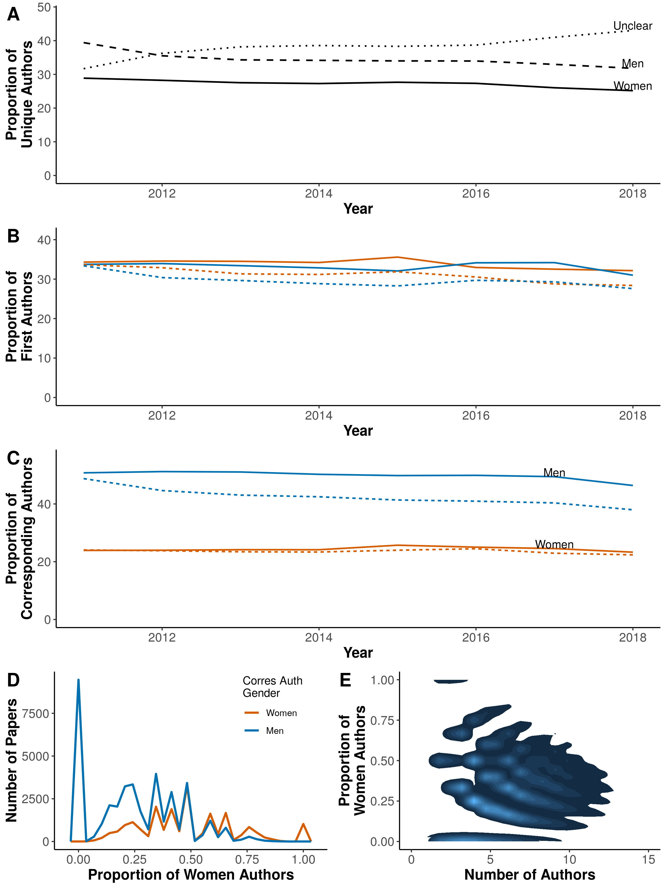

```{r setup, eval=TRUE, echo=FALSE, cache=FALSE, warning=FALSE, message=FALSE}
library(knitr)
library(kableExtra)
library(markdown)
library(rmarkdown)
library(formattable)
library(cowplot)

source("../code/load_data.R")
knitr::opts_chunk$set(echo = FALSE, warning = FALSE)
```

#Abstract

#Introduction


  Scientific societies play an integral role in the formation and maintanence of scientific communities. They host conferences that provide a forum for knowledge exchange and networking, as well as opportunities for increased visibility as a researcher. Scientific societies also frequently publish the most reputable journals in their field, facilitating the peer review process to vet new research submissions. As such, societies have great power to set both professional and scientfic norms in their community by choosing what behaviors are rewarded and what types of research are accepted for publication. Given that the authorship of such research publications is a key criterium for hiring and promotion processes in academic circles, it is a coveted measure of success. Accordingly, editors and reviewers of research journals have a substantial influence over the futures of hopeful authors. While the membership of scientific societies is likely to reflective of all those who participate in the field, regardless of career track, the gatekeepers for peer review (reviewers and editors) are more reflective of the academy than the society of a whole.

  Evidence has accumulated over the decades that academic research has a representation problem. With regards to gender, while at least 50% of biology Ph.D. graduates are women, the number of women in postdoctoral positions and tenure-track positions are less than 40 and 30%, respectively @article{sheltzer_elite_2014}. Studies examining other metrics such as race and ethnicity find that less than 10% of all science and engineering doctorates were awarded to underrepresented minorities, while less than 25% of science and engineering doctorates in early career academia identify as non-white (NSF ADVANCE, 2014). Predictabily, the disparities increase alongside academic rank, a phenomenon known as hierarchical segregation @article{potvin_diversity_2018}. There have been many proposed reasons for these disparities (particularly against women) that include biases in training and hiring, the impact of children on career trajectories, a lack of support for primary caregivers, and a lack of recognition, which culminate in reduced productivity as measured by research publications. 

  Recently, scientific societies and publishers have begun examining their own data to evaluate representation of, and bias agains, women and minorities in their peer review processes. The American Geological Union found that while the acceptance rate of women-authored publications was greater than that for publications authored by men, women submitted fewer manuscripts than men and were used as reviewers only 20% of the time (Lerback, 2017). Fox et al., have found that for the journal _Functional Ecology_, the proportion of women invited to review depended on the gender of the editor and that editors were more likely to invite individuals from their own geographic region to review (Fox, 2016). Despite the disproportional representation of lead women authors, several studies have concluded that there is no significant bias aginst papers authored by women (C&W, 2011; Fox, 2016; Handly, 2015; Edwards, 2018). Conversely, a preprint study of the peer review process at eLife found statistically significant bias against women, particularly from review groups composed of all men (Murray, 2018). Studies looking at the geographic distribution of authors have also found poor representation of non-Western countries and statistically significant bias based on geography and percieved "non-english speaking" authors (Murray, 2018; Handley, 2015; Edwards, 2018).
  
  However, gender and geographic representation can differ dramatically according to the scientific field and no studies to-date seem to have investigated academic publishing in the field of microbiology (Elseiver report). [Stats on ASM size/membership that make it a good study system]. In its mission statement, the American Society for Microbiology (ASM) notes that it is "an inclusive organization, engaging with and responding to the needs of its diverse constituencies." The ASM also pledges to "address all members' needs through development and assesment of programs and services" while the ASM Journals Department boasts of "quality peer review and editorial leadership." Therefore, in an effort to be transparent with ASM journal patrons and ASM members, the purpose of this study is to describe who are ASM journals. In other words, what is the gender and geographic representation of authors, reviewers and editors during peer review at ASM journals? Additionally, does that representation reflect the field of microbiology and ASM members?

  + Gender disparity in stem
  
  + Studies evaluating gender in publications
      + Nature
      + JAMA
      + Glam journals
      + Science?
      + Ecology (Cho, 2014; Pettorelli, 2013; Buckley, 2014)
      + Medical (Amrein, 2011; del Carmen, 2003)
      + Authorship analyis of 8 million papers - West, 2013
      + Reviewer practice by gender - Grod, 2008
      + recognition for group work - Sarsons, 2017
  
  + Few look at submissions level data to understand source of disparity
      + AGU
      + JAMA (Gilbert & Williams)
      + (Buckley, 2014)
      + eLife
  
  + This study
      + Cummulative data since 2012 to see where ASM stands
      + Build off of previous paper on ASM representation where there indicated a disparity in performance between men & women

#Results
```{r setup_gender_plots}

```
This study uses the data from manuscripts submitted to ASM journals that had a final decision rendered between January 2012 and August 2018. 

###Gender in Gatekeepers
  + Editor Notes:
      + The proportions of men/women editors are similar for both editors and senior editors -- only showed editors
      + There is a slow trend toward gender parity in editors
      + Need to add the N of each editorial group: senior editors, editors, eic
      + compare senior editors? only m journals use that heirarchy
  
    + Who carries the editorial burden?
       + How many manuscripts are editors handling -- Women handle a higher median of papers than men, across ASM. Varies by journal
       + Is it proportional to the author representation? -- in some cases, but also difficult to compare b/c of the high "unclear" proportion of authors
       + Does it change by EiC? -- doesn't seem to. Can I add gender of EIC to the graph somehow?
```{r editor_gender, fig.asp = .9}

```       
  + Reviewer Notes:
      + Median number of paper reviews are equivalent across genders, though men seem slightly more likely to review more papers - trends representative of journals, except for MCB where "unclear" reviewers are a greater proportion than women
      + Slight increase in the proportion of women over time (& decrease of men), more women reviewers than "unclear"
      + trends and approximate proportions are equvalent for potential reviewers and actual reviewers
      + greater # of women (unique indvidiuals) have been suggested as potential reviewers than # of women senior authors -- only 1/2 have actually been reviewers
      + similar trend for min, except that the proportions of potential & accepted seem to be higher - calculate & add proportions relative to senior authors
      + different trend for "unclear" authors where senior > potential > accepted
  
  + Who carries the burden of peer review?
       + How often are reviewers participating on multiple manuscripts? -- calculate proportion that only reviewed one paper
       + How does representation compare from potential to actual reviewer? -- seems equivalent
       + Is it proportional to the author representation? -- yes       
```{r reviewer_gender}

source("../code/representation/percent_cons.R")
```

###Gender in Authorship
  + Notes:
      + Proportions of men and women authors have decreased over time, while "unclear" has increased -- gap between men & women proportions unchanged since 2012
      + ratio of women:men authors is 3:4
      + First & Middle author proportions are representative
      + Last & corresponding author proportions are representative
      + Women are first authors more often than other groups -- decreasing trend of men/women first authors over time (increase of unclear)
      + Trends are similar across journals & genders
      + proportion of women corresponding/last authors has not increased over time
      + proportion of men senior authors has decreased over time -- increase of unclear senior authors
      + proportion of published is higher for both men & women than submitted proportions -- means that proportion of unclear published is lower than submitted
      + is the increase in published proportions, proportionally equivalent for men & women?

  + How do the proportions compare by gender at each stage of peer review?
       + E.g., author, reviewer, editor, eic
       + Is there variation by journal? 
       + Is it influenced by EiC gender?
       + How often are each gender on multiple submitted or published manuscripts?

```{r author_gender}

```     

###Gender Summary
  + How does gender representation of manuscripts compare from submitted to published?
      + proportion of M & W authored publications seems relatively disparate from M & W authored submissions -- unknown if bias
      + "Publication Rate Disparity" = (M publish rate) - (W publish rate) -- positive == men more likely to publish (i.e., overperform); negative == women more likely to publish
      + Men overperform in all authorship roles across ASM journals, most clear for corresponding authors
      + Break it down by journals and there is clear trend to overperformance by men in both corresponding & last authorships, some exceptions
  + Are women being retained through peer review at the same proportion as men/unclear?
      + Get actual proportions at each stage
      + seems as if fewer women progress through each stage than men
      + large proportion of potential reviewers are not senior authors (both genders)

```{r gender_summary_figs}
source("../code/representation/summary_fig.R")

summary_A
summary_B
#include_graphics("results/representation/gender_summary_figs-3.png")
```

##Papers submitted by women are rejected more frequently than those submitted by men
```{r, plot_rej_rates} 
source("../code/bias/reject_by_gender.R")

auth_type_A #A #cross ASM rejection rates (all genders)
auth_type_B #B #rejection rates by journ (m/w) -- need to highlight instances with diff > 5%
auth_type_C #breakdown of submitted manuscripts (% by gender) according to EJP.decision
auth_type_D #breakdown of C by journal -- need to highlight instances with diff > 5%
```

  + NOTE: to correct for the large discrepency in the participation of women at ASM journals during the is time period, all comparisions are made relative to the gender and population in question.
  + direct comparision of the proportion of woman-authored papers that are rejected compared to men, at each author stage
      + middle/first author rejected at similar rates
      + woman-authored (corres/last) rejected more frequently than men
      + there are several journals where the overall trend is repeated and/or amplified (e.g., AAC, IAI, JB, mBio, MCB)
      + greatest effect seen for corresponding authors, use this sub-population to further examine
  + directly compare decisions made on submitted manuscripts by author gender
      + men recieve favorable decisions (accept, revise)
      + most decisions are Accept, Reject, Revise -- look more closely at journal level
      + in most cases (except msphere, msystems, CVI), rejections are more frequently rendered to women than men

##Both men and women editors are more likely to reject papers authored by women than those authored by men
```{r, plot_ed_rej}
source("../code/bias/editorial_rejections.R")#A
source("../code/bias/editorial_rejections_by_journal.R") #E
source("../code/bias/editor_gender_analysis.R")
source("../code/bias/rej_by_inst_type.R")

ed_rejections_A #comparing editorial rejection rates by journal
ed_rejections_E #comparing first decisions by journal
ed_rejections_B #comparing decisions by editor gender
ed_rejections_C #comparing rejection/acceptance rates by instution type
ed_rejections_D #comparing acceptance rates by editor gender, author gender & author institution
```

  + There are two main gatekeeping roles for manuscript decisions: editors & reviewers
  + This section evaluates disparities made by editors during editorial rejections, and decisions following peer review. 
  + Women recieve more editorial rejections than men, proportionally (editorial_rejections.R)
  + may be complications due to geographic bias (eLife paper), restrict to papers submitted in US & examine institution type
  + slight disparity in editorial rejection & acceptance rates according to institution type (rej_by_inst_type.R)
      + greatest difference (4%) occurs for institute/medical schools
      + trend holds for most journals and is >20% diff at JCM (R2s), mBio (Federal), MCB (low research), AEM (industry research) (Supplementary_A)
      + men from institutes/medical schools outperform women >7% for acceptance across all journals 
      + >20% in favor of men at: EC (fed researh), mSphere & JVI (Low research), AEM & MCB (industry research), JCM/JB/JCM (R2 institution) (Supplementary_B)
  + both men & women editors are more likely to reject women (editor_gender_analysis.R)
      + men editors are more likely to make revise only & accept decisions for men
      + women editors highly favor men from medical schools, slightly favor men from R2 & industry
      + men editors favor men from R1, R2 and medical schools, slightly favor women from low & industry research

##Both men and women reviewers more frequently suggest rejection for papers authored by women
```{r, reviewer_rec}
source("../code/bias/rev_score_analysis.R")
reviewer_A
reviewer_B

source("../code/bias/reviewer_gender_analysis.R")
reviewer_C #difference in recommendations by reviewer gender
reviewer_D #difference in acceptance recommendations by reviewer gender & institution type

```

  + rev_score_analysis.R
    + reviewers are more likely to suggest rejections for women as compared to men. No difference in revise decisions (A)
    + men at R1, low research, medical schools & fed research are favored by reviewers over women (B)
  + reviewer_gender_analysis.R
    + both female & male reviewers are more likely to recommend rejection for women. (C)
    + Male reviewers are more likely to accept papers from men (C)
    + women reviewers are more likely to recommend acceptance for women from low research & federal institutions (D)
    + women reviewers are more likely to recommend acceptance for men from R1 & industry instutitions (C)
    + men are more likely to recommend acceptance for women from R2 institutions & favor men from R1 & medical institutes (D)
  
##Factors affecting competency  
```{r, other_factors, echo=FALSE, message=FALSE}
source("../code/bias/time_to_publication.R")
factors_A #days pending at each journal

source("../code/bias/time_at_journ.R")
factors_B #days in peer review system

source("../code/bias/time_to_final_rejection.R") #supplementary D & E

source("../code/bias/impact_analysis.R")
factors_C #cites per month
factors_D #total manuscript reads (HTML+PDF)

source("../code/bias/bias_by_jif.R")
factors_E #no difference in submitted to mbio vs msphere
```
  
  + In addition to rejectance/acceptance rates, other disparate outcomes may occur during the peer review process
  + Time in Peer Reivew (time_to_publication.R)
      + Papers published by women take slightly longer (from submission to ready for publication) than men at some journals (mSphere, mBio, mSystems, CVI, JB, JCM, AEM) despite spending similar amounts of time at ASM journals (A, B)
      + but do not require a greater number of revisions to be accepted than men (Supplementary_C)
      + Papers rejected following review that were submitted by women do not generally take longer (in days) to be rejected (except at mSystems) or have more revisions (Supplementary_D & _E)
      + Decisions are returned to men & women similarly (time_at_journ.R)
  + Peer review is not a linear process, it is cyclical and builds upon its self, may also be disparities in impact (impact_analysis.R)
      + Women tend to receive lower cites per month published than men 
      + HTML/PDF/Abstract views are equivalent 
      + women are more likely to be published in lower JIF journals
      + No disparity in gendered sumissions to high (mBio) vs lower (mSphere) journals (bias_by_jif.R)

#Discussion
  + Summarize results
      + Gender
          + Women/men/unclear are X percent of authors, reviewers, editors
          + Women/men/unclear are more likely to be repeat authors/submitters
          + X are more likely than X to be suggested as reviewers and are/are not used as reviewers at the same proportion
          + M/F editors are more likely to handle multiple manuscripts
          + Women are/are not retained to the same extent as men/unclear
          + These observations do/do not correlate with gender of EiC
    + Compare to global and ASM membership stats
      + Globally - microbiology researchers are 60:40, M:F - Elsevier
      + ASM membership - 
  + Discuss the impact of under representation in publication
      + “It [reviewing] provides positive feedback that a scholar is respected and participating in their field and fosters self-confidence, all of which lead to increased retention of women in geoscience” Lerback & Hanson, 2017
      + Less diversity may reduce the diversity of perspectives & approaches valued & represented. - Fox et al, 2016
      + Thus authors conclude it is an issue of female "visibility" versus "availability". Suggestion that being selected as a reviewer increases visibility, which has a direct & significant impact on salary. , under-rep of W in Sci b/c of positions w. fewer resources. "Participating in the peer-review process is an important way that early-career researchers can feel more involved with, and contribute to, the scientific community" - Buckley et al, 2014
      + Must be balanced w. the increased burden for department service
  + Discuss literature on diversity and innovation - incentive to increase representation - well-documented that orgs w. more diverse & equitable representation are both more inclusive & supportive as well as more productive & innovative - Potvin, 2018
  + Suggestions to improve representation
      + Apply the additional suggestions from the Scientific Society health checklist to society journals:
          1. Include a visible mission/vision statement or other commitment to equality & diversity that includes a non-discrimination clause regarding editors & EiCs
          1. Collect additional data (e.g., race/ethnicity, sexual/gender minorities) & present numbers publicly to maintain accountability
          1. Have a specific protocol for the reporting of & responding to discrimination & harassment
          1. Be explicit about support for women (& other minority groups). 
                    + Formally (e.g., providing waivers, reduced copyediting services, reword to gender/location-neutral) 
                    + Informally (e.g., rewarding inclusive behavior by candidates, encouraging women to take up leadership positions, have gender-neutral, non-exclusive, family-friendly social activities)
      + Representational vs aspirational?
          + Largest & less visible workload (reviewing) should be representational
                  + When choosing reviewers it may be better for editors to rely more on manuscript reference lists & data base searches than on personal knowledge - Fox et al, 2016
                  + Suggest more women as reviewers
                  + Improve backend/interactivity of peer review selection
          + Higher visibility workload (editor, EiC) should be aspirational, recruit more women 
  + fit into context of field -- 
      + few papers have found disparties between rejection rates of men & women
      + first paper (to our knowledge) to collectly examine this issue on 10+ journals using submissions data
      + literature to connect institution type findings
          + compentency? 
          + access to resources
          + "family friendly"/less committed institutions
          + other sterotypes
  + study limitations
      + doesn't include reviewer comments
      + limited journal dataset, difficult to know how other microbiology-publishing journals affect submissions to ASM journals
      + many ASM journals have a narrow focus, & broad scope journals are relatively new -- limits conclusions b/c of journal selection
  + future directions
      + implicit bias training is insufficient
      + consider double-blinded peer review 
          + common practice in social sciences
          + can then be unblinded following decision
      + increase diversity of gatekeepers 
          + increase inclusivity & goodwill/author buy-in
          + women/urm at "fringes" of fields, less likely to be viewed as "competent"


#Data and Methods

###Data

All manuscripts handled by ASM journals (e.g., _mBio_, _Journal of Virology_) that recieved an editorial decision between January 1st, 2012 and August 31st, 2018 were supplied as XML files by ASM's publishing platform, eJP. Data were extracted from the XML documents provided using R statistical software (version 3.4.4) and the `XML` package (R citation). Data manipulation was handled using the `tidyverse`, `lubridate`, and `xml2` packages for R. Variables of interest included: the manuscript number assigned to each submission, manuscript type (e.g., full length research, erratum, editorial), category (e.g., microbial ecology), related (previously submitted) manuscripts, versions submitted, dates (e.g., submission, decision), author data (e.g., first, last, and corresponding authorships, total number of authors), reviewer data (e.g., reviewer score, recommendation, editor decision), and person data (names, institutions, country) of the editors, authors, and reviewers. 

###Data analysis and presentation

For this analysis, only original, research-based manuscripts were included, e.g., long- and short-form research articles, New-Data Letters, Observations, Opinion/Hypothesis articles, and Fast-Track Communications.

It is common practice at ASM journals for manuscripts whose reviewers recommend extensive experimental revisions be given a decision of "reject with resubmission encouraged". If resubmitted, the authors are asked to note the previous (related) manuscript and the resubmission is assigned a new manuscript number. Multiple related manuscripts were tracked together by generating a unique grouped manuscript number based on the recorded related manuscript numbers. This grouped manuscript number served multiple purposes including: tracking a single manuscript through multiple rejections or transfers between ASM journals and to avoid duplicate counts of the same authors for the same manuscript. 

Data were visualized using the `ggplot`, `scales`, `RColorBrewer`, and `ggalluvial` packages for R.

###Gender prediction and assignment

  The gender assignment API genderize.io was used to predict an indivdual's gender based on their given names, and country where possible. The genderize.io platform uses data gathered from social media to predict gender based on given names with the option to include an associated language or country to enhance the odds of succesful prediction. Since all manuscripts are submitted in English, precluding language association for names with special characters, names were standarized to ASCII coding (e.g., "José" to "Jose"). We next matched each individuals country against the list of X country names accepted by genderize.io. Using the `GenderGuesser` package for R, all unique given names  associated with an accepted country were submitted to the genderize.io API and any names returned without a predictive assignment of either male or female were resubmitted without an associated country. All predictive assignments of either male or female are returned with a probability match of 0.50 or greater. The predicted genders of all given names (with and without an associated country) whose probabilities were greater or equal to our arbitrary success cut off of 0.65 were used to assign predicted gender to the individuals in our dataset. Predicted genders were assigned to individuals in the following order: first names and country, first names, middle names and country, middle names (Supplemental Figure 1). The presenting gender (man/woman) of editors and senior editors in our dataset was hand validated using Google where possible. 
  
  We recognize that biological sex (male/female) is not always equivalent to the gender that an individual presents as (man/woman), which is also distinct from the gender(s) that an individual may self-identify as. For the purposes of this manuscript, we choose to focus on the presenting gender (man/woman/unclear) based on their first names and/or appearance (for editors). In the interest of transparency, we include those individuals whose names don't allow a high degree of confidence for gender assignment in the "unclear" category of our analysis. 

###Validation of gender prediction
```{r genderize_setup, include=FALSE}
source("../code/genderize/b_c_comparison.R")
```

  We first validated the algorithm using a set of `r total_names_ascii` names whose gender had been hand-coded based on appearance and were generously provided to us by ___ (preprint cite). The names were supplied to the genderize algorithm both with and without the accompanying country data. The data returned include the name, predicted gender (male, female, na), the probability of correct gender assignment (ranging from 0.5 to 1.0), and the number of instances the name and gender were associated together (1 or greater). The genderize algorithm returned gender predictions for `r compared_names_ascii` when first names were given and `r country_ascii_compared_names` when country data was also supplied (`r compared_names_ascii - country_ascii_compared_names` names were associated with countries unsupported by genderize).
  
  Senstivity and specificity, are measurements of the algorithm's tendency to return correct answers instead of false positives (e.g., a man incorrectly gendered as a woman) or false negatives (e.g., a woman incorrectly gendered as a man). The closer these values are to 1, the smaller the chance that the algorithm will return the correllating false reponse. Accuracy is a composite measure of the algorithm's ability to differentiate the genders correctly. These measurements were calculated from the datasets (with and without country data supplied) at three different probability threshold cutoffs: the default genderize (0.5), a probability threshold of 0.85 (0.85), and a modified probability  of 0.85, which factors in the number of instances returned (pmod0.85)(citations). 
  
   At the 0.5 threshold, the dataset returned a sensitivity of `r b_c_ascii_summary[1,2]` and specificity of `r  b_c_ascii_summary[2,2]` for an accuracy of `r b_c_ascii_summary[3,2]`, compared to a marginally higher accuracy of `r b_c_country_ascii_summary[3,2]` for the dataset where country data were included (Supplemental Table 1). Generally speaking, the accuracy increases as the threshold increases along with slight tradeoffs between sensitivity and specificity. For the purposes of our analysis, we opted to use the pmod0.85 threshold moving forward (Supplemental Table 1, in bold). 

```{r country_impact, message=FALSE}
source("../code/genderize/b_c_country_na.R")
```
  To understand the extent of geographic bias in our gender assignment against regions and languages with genderless naming conventions, or that lack social media for incorporation into the genderize algorithm, we compared the number of names predicted without associated country data to when country data was also supplied. In our test dataset, the top five countries associated with names were `r top_five_num` and the countries with the highest proportion of un-predicted genders when country data were supplied are `r top_five_na`, where the maximum number of names supplied ranged from `r min_names_five_na` to `r max_names_five_na`. To determine the impact of each country towards the overall percentage of names whose genders were not predicted (`r percent_unpredicted`%), we found the difference between the percent of names unpredicted for each country and the overall percentage, multiplied by the proportion of observations from that country to the total observations and finally divided by the overall percentage of unpredicted names (Supplemental Figure 2). The top five countries with the greatest impact on unpredicted names, and thus the countries recieving the most negative bias from genderize were `r top_five_impact` (Supplemental Figure 3). These data suggest that there is likely some bias against countries with gender-neutral naming conventions (China), and indicates the stringency with which the algorithm applies gender to names that are accompanied by country data. For instance, strongly gendered names such as Peter and Pedro were not assigned gender when associated with Canada.

```{r editor_genderize, message=FALSE}
source("../code/genderize/editor_comparison.R")
```
  We next applied the genderize algorithm at the pmod0.85 threshold to our journals dataset and tested its validity on a small portion. All first names collected from our dataset were submitted to genderize both with and without country data. Only those predictions whose pmod were equvalent or greater than 0.85 were carried to the next step. The predicted genders were assigned to individuals in the following order: first names and country, first names, middle names and country, middle names. Given the relatively small number of editors and senior editors in our dataset, the presenting gender (man/woman) of editors and senior editors in our dataset was hand-validated using Google where possible. Of the `r total_ed_names` editor names, `r compared_ed_names` were predicted by genderize for an accuracy of `r ed_accuracy`, thus increasing our confidence in the gender predictions where made. 

```{r ASM_genderize_setup, message=FALSE}
source("../code/genderize/ASM_country_na.R")
```
  In our full dataset, the five countries with the most individuals were `r ASM_top_five_num` and the countries with the highest proportion of un-predicted genders were `r ASM_top_five_na`, where the maximum number of names supplied ranged from `r ASM_min_names_five_na` to `r ASM_max_names_five_na`. Proportionally, fewer names in our full dataset were assigned gender than in our validation dataset (`r ASM_percent_unpredicted`% unpredicted versus `r percent_unpredicted`% unpredicted, respectively). Since adjusting the workflow to predict the gender of names both with and without country data, the countries recieving the most negative bias from genderize were `r ASM_top_five_impact` (Supplemental Figure 4). These data indicate what we previously predicted, that the genderize algorithm has bias against countries with gender-neutral naming conventions.

#References
