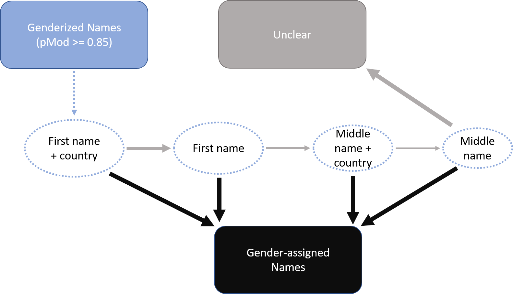
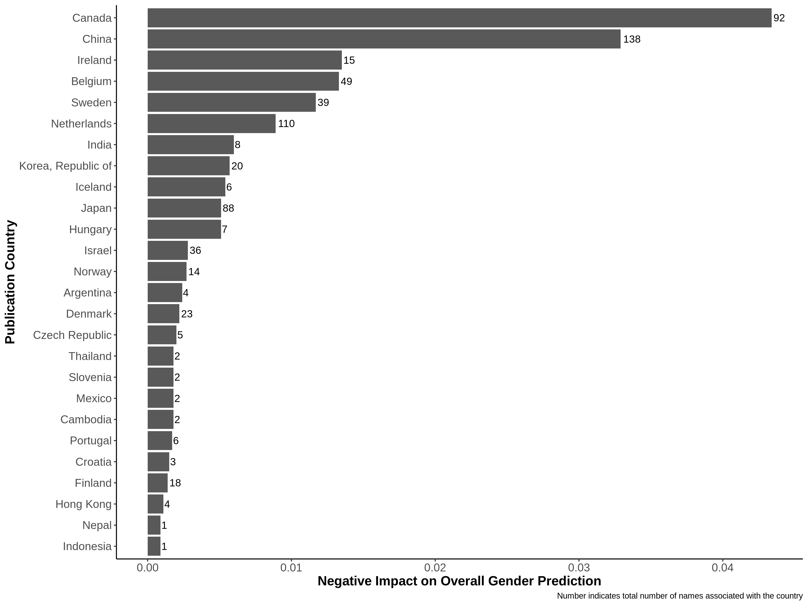
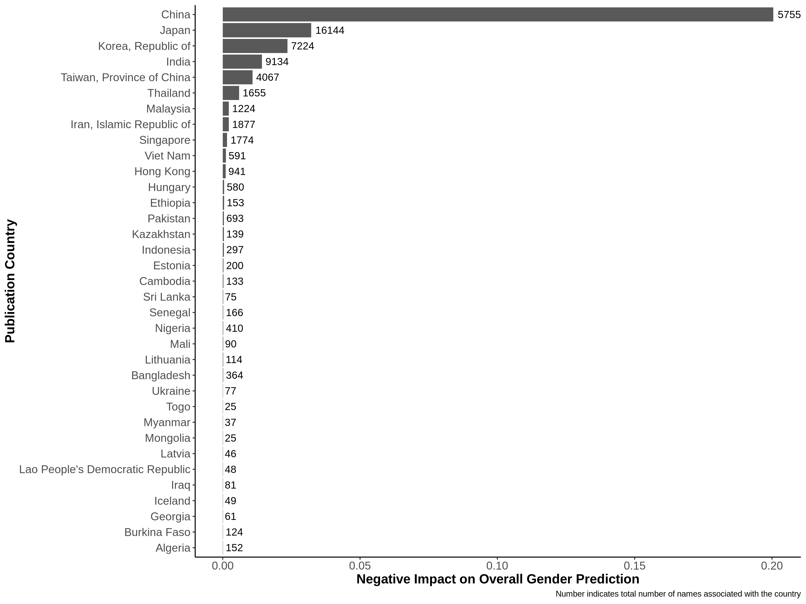

```{r supp_setup, include=FALSE}
library(knitr)
library(kableExtra)
library(markdown)
library(rmarkdown)
library(formattable)
library(png)

knitr::opts_chunk$set(echo = FALSE, warning = FALSE)
```

#Gender bias
Supplemental Figure 5 
```{r, Supplementary_1}
#source("../code/rej_by_inst_type.R")

#Supplementary_A
#Supplementary_B

#Supplementary_C #number of versions by gender and journal
#Supplementary_D #days from submission to rejection by journal & gender
#Supplementary_E #number of versions to rejection by gender & journal

#supplementary_inst -- fig 7 B/C, fig 8 B/D
```


##Gender prediction and assignment
**Supplemental Figure 1. Schematic of gender prediction & assignment**
```{r}

```


##Validating gender analysis
```{r genderize_setup, include=FALSE}
source("../code/genderize/b_c_comparison.R")
```


**Supplemental Table 1. sensitivity/specificity/accuracy of genderize thresholds**
```{r genderize_stats, results='asis'}  
stats_summary %>% 
  mutate(b_c_data_ascii_pmod85 = ifelse(b_c_data_ascii_pmod85 == "0.9714", 
    cell_spec(b_c_data_ascii_pmod85, bold = T),
    cell_spec(b_c_data_ascii_pmod85, background = "white")),
    b_c_country_data_ascii_pmod85 = ifelse(b_c_country_data_ascii_pmod85 == "0.9695", 
    cell_spec(b_c_country_data_ascii_pmod85, bold = T),
    cell_spec(b_c_country_data_ascii_pmod85, background = "white"))
  ) %>% 
knitr::kable(., format = "html", table.attr = "style = \"color: black;\"", digits = 4, col.names = c("Measure", "p0.5", "p0.85", "pmod0.85", "p0.5", "p0.85", "pmod0.85"), escape = F) %>%
  kable_styling() %>% 
  add_header_above(c(" " = 1, "First Names" = 3, "Plus Country Data" = 3)) %>% 
  footnote(general = "Bolded text denotes the accuracy of the threshold used in all further analyses")
```


**Supplemental Figure 2. Equation for calculating negative bias by genderize**
```{r}

```


**Supplemental Figure 3. Validation dataset, country impact**
```{r}

```


**Supplemental Figure 4. country impact for full ASM dataset**
```{r}

```

